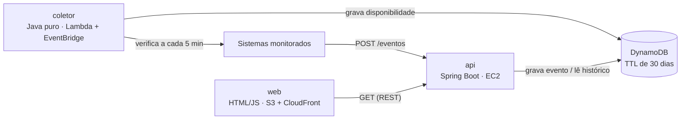

# Sentinela

[](https://github.com/gualmeidap/sentinela/actions/workflows/ci.yml)


Portal que mostra, numa tela só, o estado dos sistemas que mantenho em produção
— e o que esses sistemas fizeram.

Projeto pessoal com dois propósitos: ter o painel de fato, e servir de portfólio
para vagas de back-end Java.

## O problema

Monitoramento comum responde uma pergunta: *o sistema está de pé?* O Sentinela
responde duas.

1. **Disponibilidade** — cada sistema está respondendo, e em quanto tempo.
2. **Eventos de negócio** — o que cada sistema fez. Quantas redefinições de
   senha deram certo hoje, quantas falharam, e por quê.

A segunda é o diferencial. UptimeRobot, Grafana Loki e CloudWatch resolvem a
primeira muito bem, mas nenhum deles sabe o que é uma "redefinição de senha" ou
uma "nota processada" — esse significado só existe dentro dos sistemas
monitorados.

Saber que o sistema devolveu `200` em 180 ms não conta que as redefinições de
senha estão falhando há duas horas porque uma dependência saiu do ar. O painel
verde e o usuário travado convivem sem se contradizer, e é justamente esse vão
que o Sentinela cobre.

## Dado pessoal não atravessa

Restrição inegociável: **nenhum dado pessoal entra no Sentinela.** Sem nome,
matrícula, CPF, e-mail ou identificador de usuário.

Não se trata de mascarar na exibição — o dado nunca sai do sistema de origem.
Quem precisa saber *quem* fez consulta o log de auditoria do sistema de origem,
que já existe e é o lugar certo para isso.

O Sentinela responde **o quê, onde, quando e com que resultado**. Nunca "com quem".

## Arquitetura



| Peça | O que faz | Tecnologia | Estado |
|---|---|---|---|
| `coletor/` | A cada 5 min chama cada sistema e grava se respondeu e em quanto tempo | Java puro, Lambda + EventBridge | verificando local |
| `api/` | Recebe eventos publicados pelos sistemas, lê histórico e expõe REST | Spring Boot em EC2 | disponibilidade no ar (local) |
| `web/` | Página com o painel | HTML/JS estático, S3 + CloudFront | painel lendo a API local |
| — | Persistência | DynamoDB | não iniciado |

**As peças não se chamam entre si.** O banco é o único ponto de encontro: o
coletor escreve, a API lê. Uma peça fora do ar não derruba a outra, e cada uma
sobe, cai e escala sozinha — o que também torna possível rodar só a API na
máquina local, sem coletor nenhum, que é como o projeto começou.

### Estrutura do repositório

```
sentinela/
├── api/                      Spring Boot — única peça com código hoje
│   ├── mvnw, mvnw.cmd        Maven Wrapper: build sem instalar Maven
│   ├── pom.xml
│   └── src/
│       ├── main/java/com/sentinela/api/
│       │   ├── sistema/          catálogo dos alvos (lista fixa, passo 1)
│       │   ├── disponibilidade/  regra de cálculo, persistência e endpoints
│       │   ├── erro/             tradução de exceção em resposta HTTP
│       │   ├── dev/              semeador de dados sintéticos (perfil local)
│       │   └── ping/
│       └── test/java/com/sentinela/api/
├── coletor/                  Java puro, zero dependências de execução
│   ├── mvnw, mvnw.cmd
│   ├── pom.xml
│   ├── alvos.exemplo.properties
│   └── src/main/java/com/sentinela/coletor/
└── web/                      painel estático, sem build
    ├── index.html
    ├── estilo.css
    └── painel.js
```

## Decisões

### Por que DynamoDB e não Postgres

O portal só tem valor se ficar ligado indefinidamente, e o RDS não está no
Always Free da AWS — uma instância gerenciada cobra por hora, ociosa ou não. O
DynamoDB está, com 25 GB e capacidade suficiente para esta carga.

O custo dessa escolha seria consulta complexa, mas ela não aparece aqui: tudo
que o painel pergunta é "os registros do sistema X neste intervalo de tempo",
que é exatamente o acesso por chave de partição mais faixa de ordenação para o
qual o DynamoDB foi feito. Sem junção, sem relatório ad-hoc, sem agregação de
longo prazo na v1. Escolher relacional seria pagar em custo fixo por
flexibilidade que o escopo não usa.

### Por que Java puro no Lambda e Spring Boot na API

São perfis de execução opostos.

O coletor roda a cada 5 minutos, faz algumas chamadas HTTP e morre. O cold start
do Spring Boot — vários segundos subindo contexto e varrendo classes — seria
gasto em toda invocação, para inicializar uma infraestrutura que a função nem
usa. Java puro sobe em milissegundos.

A API é long-running: sobe uma vez e fica. O custo de inicialização é pago uma
vez só, e em troca vêm injeção de dependência, serialização, validação e
tratamento de erro prontos. Aqui o Spring paga por si.

### Por que evento com código fechado, e não log corrido

`tipo` e `motivo` são códigos de uma lista fechada — nunca texto livre, nunca
mensagem de exceção crua.

Mensagem crua mais cedo ou mais tarde carrega junto um nome de usuário ou um
caminho interno, e aí o dado pessoal entra pela porta dos fundos sem ninguém ter
decidido isso. Além do risco, ela quebra o agrupamento: `"Connection refused to
servidor-a"` e `"Connection refused to servidor-b"` são duas strings diferentes
e uma única causa. Com código fechado, três falhas pelo mesmo motivo aparecem como
"3 falhas, todas pela mesma dependência indisponível" — que é a informação útil.
"3 falhas" não é.

### Por que a lista de tipos e motivos vive na configuração

`tipo` e `motivo` são lista fechada, mas a lista mora no `application.yml`, por
aplicação — não num `enum` Java. Acrescentar um código novo passa a ser mudança
de configuração em vez de recompilação e deploy, sem deixar de ser fechado: o
que não está declarado é recusado com `400`.

O mesmo bloco de configuração declara quem pode publicar, com que chave, com que
códigos e com que volume. Manter as quatro coisas juntas evita o caso clássico
de alguém cadastrar uma chave nova e esquecer do limite.

### Por que valor de contexto só aceita código

O modelo permite campos de contexto extras (`campus`, `fornecedorTipo`) desde que
não identifiquem pessoa. Só que "não identifica pessoa" não se verifica sozinho —
então a regra virou formato: chave declarada na configuração, e valor obrigado a
casar com `^[a-z0-9][a-z0-9_.-]{0,39}$`.

`unidade_2` passa. `Joao da Silva` e `joao@exemplo.com` não. É uma barreira
estrutural, não um pedido de boa vontade ao publicador.

### Por que o coletor não tem nenhuma dependência

O `coletor/` declara zero dependências de execução — nem uma. Cliente HTTP,
leitura de configuração e concorrência já vêm no JDK 21.

O motivo é custo: ele roda numa Lambda a cada 5 minutos, e cada jar no classpath
vira tempo de cold start em toda invocação. É a mesma razão de não usar Spring
aqui, levada até o fim.

Os alvos são verificados em paralelo com **threads virtuais** do Java 21. A
espera é de rede, não de processamento; em série, dez alvos custariam a soma de
dez esperas — e a Lambda cobra por tempo de execução.

### Por que o coletor duplica a classe `Verificacao`

Ela é quase igual à do `api/`, e a duplicação é deliberada. Um jar compartilhado
entre as duas peças viraria, com o tempo, um caminho de acoplamento: uma mudança
no formato de leitura da API poderia quebrar o coletor rodando em produção sem
ninguém ter tocado nele. As peças se encontram no banco e em nenhum outro lugar
— inclusive no código.

### Por que a página não tem framework

O painel é HTML, CSS e JavaScript puros. Não é purismo: o destino dele é ser
arquivo estático servido pelo CloudFront, e um framework acrescentaria um passo
de build entre escrever e publicar — mais uma coisa para quebrar, versionar e
manter, em troca de conveniência que uma tela com três cartões não precisa.

A regra de negócio também não está lá. Fita, percentual e estado de bloco são
calculados na API; a página só desenha o que recebe. Se o cálculo vivesse no
JavaScript, ele teria de ser reescrito e testado de novo em qualquer outro
consumidor — e sairia do alcance dos testes automatizados.

### Por que o banco é o único ponto de encontro

Coletor e API nunca se chamam. Se o coletor tivesse que avisar a API a cada
verificação, uma API fora do ar viraria buraco no histórico, e a Lambda passaria
a precisar de rota de rede até a EC2 — que na AWS é onde aparece o NAT Gateway,
cobrado por hora só de existir. Escrevendo direto no DynamoDB, o coletor não
depende de ninguém e o custo continua no Always Free.

## Modelo de evento

Cada sistema publica em `POST /eventos`, autenticado por chave própria da
aplicação.

```json
{
  "sistema": "sistema-publicador",
  "tipo": "senha.redefinida",
  "resultado": "falha",
  "motivo": "dependencia_indisponivel",
  "ocorridoEm": "2026-08-30T14:20:11Z"
}
```

- `tipo` e `motivo` vêm de lista fechada.
- `resultado` é `sucesso` ou `falha`. `motivo` só aparece em falha.
- Campos de contexto adicionais são permitidos desde que não identifiquem
  pessoa (ex.: `campus`, `fornecedorTipo`).

## Endpoints

| Método | Rota | O que faz | Estado |
|---|---|---|---|
| `GET` | `/ping` | Verificação de vida da própria API | no ar |
| `GET` | `/sistemas` | Lista os sistemas monitorados com o estado de cada um agora | no ar |
| `GET` | `/sistemas/{id}/disponibilidade` | Fita das últimas 24 h em blocos de 15 min, com o percentual | no ar |
| `POST` | `/eventos` | Recebe evento de negócio, autenticado por chave da aplicação | no ar |
| `GET` | `/sistemas/{id}/eventos` | Contagem do dia por tipo e resultado, falhas por motivo, e os últimos eventos | no ar |

Todo erro sai no formato ProblemDetail (RFC 7807), com um campo `codigo` estável
para o cliente decidir o que fazer sem depender do texto:

| Situação | Status | `codigo` |
|---|---|---|
| Chave ausente ou desconhecida | `401` | `chave_invalida` |
| Chave publicando por outro sistema | `403` | `publicacao_nao_autorizada` |
| Tipo ou motivo fora da lista fechada | `400` | `tipo_desconhecido`, `motivo_desconhecido` |
| Campo que a API não conhece no payload | `400` | `corpo_ilegivel` |
| Volume acima do combinado | `429` | `limite_excedido` |

**Nenhuma resposta de erro devolve conteúdo da requisição.** Num portal cuja regra
é que dado pessoal não atravessa, a mensagem de erro é justamente por onde ele
passaria sem ninguém perceber.

## Escopo da versão 1

Fechado. Alerta, login, gráfico histórico e métrica agregada de longo prazo
ficam para depois.

**Disponibilidade**
- Sistema monitorado tem nome e URL. A lista vem de configuração externa, nunca
  do repositório.
- Verificação a cada 5 minutos: horário, respondeu ou não, tempo de resposta.
- Na tela: indicador verde/vermelho, tempo de resposta atual e disponibilidade
  das últimas 24 h em fita de blocos de 15 minutos.

**Eventos**
- `POST /eventos` com chave por aplicação.
- Um único publicador na v1, escolhido por ter volume diário suficiente para
  validar a tela (dezenas de eventos/dia, contra ~1 por dia nos demais
  candidatos).
- Na tela, por sistema: contagem do dia agrupada por tipo e resultado
  ("47 sucesso, 3 falha") e lista dos últimos eventos com horário, tipo,
  resultado e motivo. Falha sempre agrupada por motivo.

**Contenção de volume**
- TTL no DynamoDB: registros expiram sozinhos, 30 dias como ponto de partida.
- Limite de escrita por aplicação: se um sistema disparar volume anormal, o
  portal para de aceitar daquela chave e registra o silenciamento.

## Duas instâncias

Mesmo código, dois ambientes.

A **privada** monitora e recebe eventos dos sistemas reais, atrás de
autenticação. A **pública** é a demo deste repositório: monitora alvos
fictícios e recebe eventos sintéticos.

Nada da instância privada — URL interna, nome de sistema, IP ou chave — aparece
em código, configuração versionada, README ou imagem. É por isso que os
identificadores neste documento são genéricos, e por isso que a lista de alvos
vem sempre de configuração externa.

## Como rodar

Requer apenas **Java 21**. O Maven vem junto no repositório (Maven Wrapper),
então não é preciso instalar Maven.

```bash
cd api && ./mvnw spring-boot:run
```

No PowerShell, use `.\mvnw.cmd spring-boot:run`. A aplicação sobe em
`http://localhost:8080`.

```bash
curl http://localhost:8080/sistemas
```

### O coletor

Requer apenas Java 21. A lista de alvos **nunca** vem do repositório: copie
`coletor/alvos.exemplo.properties` para `alvos.properties` (bloqueado no
`.gitignore`) e edite.

```bash
cd coletor && ./mvnw -q package && java -jar target/sentinela-coletor-0.0.1-SNAPSHOT.jar alvos.properties
```

Saída de uma rodada:

```
verificando 3 alvo(s), tempo limite de 5000 ms
  22:24:32  alvo-fora-do-ar         FORA         91 ms  CONEXAO_RECUSADA
  22:24:32  sentinela-api           no ar       112 ms  HTTP 200
  22:24:32  sentinela-painel        no ar       113 ms  HTTP 200
  3 alvo(s) verificado(s), 1 fora do ar
```

Na Lambda não há disco para arquivo de configuração, então a lista vem da
variável de ambiente `SENTINELA_ALVOS`, no formato `id=url;id=url`. O tempo
limite sai de `SENTINELA_TIMEOUT_MS` (padrão 5000).

Por enquanto o coletor só imprime o resultado: ele e a API se encontram no banco,
e o banco compartilhado só existe a partir do passo 4.

### O painel

Sirva a pasta `web/` em qualquer servidor estático. A porta 5500 é a que já vem
autorizada no CORS da API:

```bash
python -m http.server 5500 --directory web --bind 127.0.0.1
```

E abra `http://127.0.0.1:5500`.

A API só entrega resposta às origens declaradas em `sentinela.origens-permitidas`,
no `application.yml`. Se você servir a página em outra porta, acrescente a origem
lá — senão o navegador recusa a resposta e a página exibe o aviso de conexão.

No perfil `local`, que é o padrão, a aplicação semeia 24 h de verificações
sintéticas na subida — o coletor que gera medição de verdade só existe no passo
5. Sem isso os endpoints responderiam corretamente uma tela vazia, e não daria
para conferir se a fita e o percentual estão certos. Fora do perfil `local` nada
é semeado: dado sintético misturado com medição real seria pior do que dado
nenhum.

Para rodar os testes:

```bash
cd api && ./mvnw test
```

## Estado atual

Cada etapa funcionando antes da próxima. Nada sobe para a AWS antes de rodar local.

- [x] **1.** Spring Boot local, banco local, lista de sistemas fixa no código,
      endpoints de disponibilidade respondendo
- [x] **2.** Página simples lendo da API local
- [x] **3.** `POST /eventos` funcionando local, eventos enviados na mão via curl
- [ ] **4.** Troca do banco local para DynamoDB
- [ ] **5.** Coletor em Java puro, local primeiro, depois em Lambda com
      EventBridge — *local pronto: verifica em paralelo, classifica cada modo de
      falha e imprime a rodada; falta a Lambda*
- [ ] **6.** Deploy: API na EC2, página no S3 com CloudFront
- [ ] **7.** Publicação de eventos reais pelo sistema de origem

Como parte do escopo e não como extra, já de pé: **23 testes** cobrindo cálculo
de disponibilidade, agregação em blocos, rejeição de verificação malformada e a
regra de CORS; e **CI no GitHub Actions** rodando tudo a cada push, num runner
Linux — que é o que pega o que só quebra fora do Windows.

Ainda pendentes, junto das etapas que os criam: agregação de evento por motivo,
limite de escrita por aplicação, e o tratamento explícito de alvo que não
responde, alvo lento demais, banco recusando escrita e Lambda estourando o tempo.

## Custo

Conta AWS no plano gratuito, com crédito limitado. Alerta no AWS Budgets antes
de subir qualquer coisa. Sem NAT Gateway, que cobra por hora só de existir.
Preferência sempre pelo que estiver no Always Free — foi o critério que decidiu
o DynamoDB.
